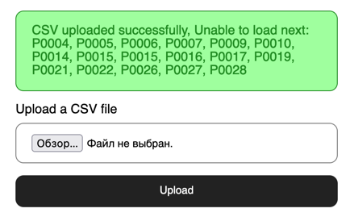
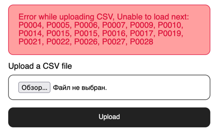

# Simple Laravel CSV import

1. Database divided by Products and Product Params (cost and stock quantity)
2. All logic separated from Controllers by Services
3. Data manipulations can be provided by methods in Product Model
4. For Asset Bundling using Vite
5. For page styling using SASS (SCSS)

Success upload page:

Error while uploading page:

